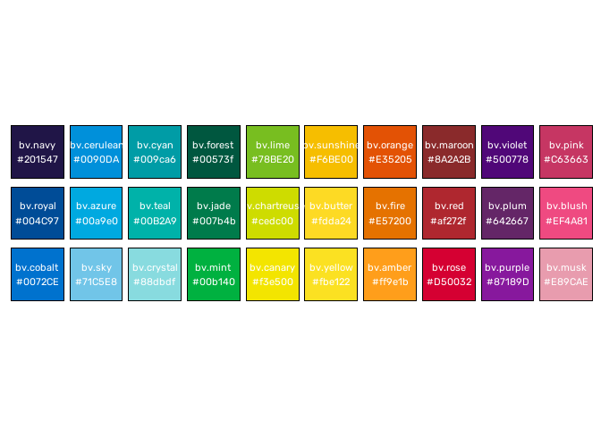
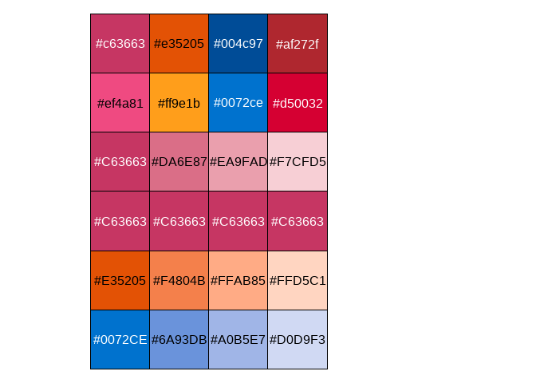
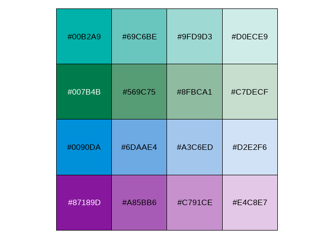

<!-- README.md is generated from README.Rmd. Please edit that file -->

# vpstheme

This package is a prototype. While it has useable palettes and themes
for the Department of Health and Department of Families, Fairness and
Housing as well as a range of helper functions, these palettes and
themes require refinement.

<!-- badges: start -->
<!-- badges: end -->

The main purpose of **vpstheme** is to enable R users in the Victorian
Public Service to use the colours and fonts defined in the [Brand
Victoria Guidelines](https://www.vic.gov.au/brand-victoria-guidelines)
to create compliant visualisations in ggplot.

**vpstheme** was created with the **palettes** package, which provides a
comprehensive library for colour vectors and colour palettes using a new
family of colour classes (`palettes_colour`, and `palettes_palette`)
that always print as hex codes with colour previews.

See the following vignettes to learn how to use palletes with other
packages:

- [Using palettes with
  ggplot2](https://mccarthy-m-g.github.io/palettes/articles/ggplot2.html)

- [Compatibility with other colour
  packages](https://mccarthy-m-g.github.io/palettes/articles/compatibility.html)

## Installation

You can install the development version of **vpstheme** from
[GitHub](https://github.com/) with:

``` r
# install.packages("devtools")
devtools::install_github("zerogetsamgow/vpstheme")
```

## Brand Victoria

At the core of **vpstheme** are elements of Brand Victoria, including
colours, palettes and fonts.

### Brand Victoria colours

The Brand Victoria colour palette consists of ten primary colours, shown
below.

    #> Loading required package: curl
    #> Using libcurl 8.10.1 with Schannel
    #> Loading required package: jsonlite


Incorporating the primary colour palette, the Brand Victoria secondary
colour palette is designed to accommodate the great range of
applications across all sectors of the brand.

The palette has been categorised in 10 colour groups, from navy to pink,
but the colours do not have to be used in these sets.

Any colour can appear next to another, as long as its use follows
guidelines and the colours are a harmonious colour combination.

The first colour of each secondary group is shown below.


A selection of other colours from each group are included in this
version of the package. Each colour is named. The included colours and
their names are shown below.



Each colour can be referenced directly using the {bv.\*} format or via
the palette object, eg `bv_colours$primary[1]` as shown below.

``` r
bv.navy
#> <palettes_colour[1]>
#> • #201547

bv_colours$primary[2]
#> <palettes_colour[1]>
#> • #00B2A9

bv.pink
#> <palettes_colour[1]>
#> • #C63663

bv_colours$secondary[4]
#> <palettes_colour[1]>
#> • #00573F
```

### VIC font

VIC is the brand font to be used across all communications. The `.otf`
files for VIC font are saved in this package, but are not currently
available for use.

In place of VIC font, **vpstheme** uses
[Rubik](https://fonts.google.com/specimen/Rubik) which is loaded on
attachment using the **systemfonts** package.

## Departmental themes and colours

### Colour palettes

**vpstheme** utilises the Brand Victoria colours defined in the package
to create Departmental palettes. Currently, the package includes
palettes for:

- [Department of Health](https://www.health.vic.gov.au/) - `dh_colours`
  is based on the departments standard templates, with a `primary` and
  `secondary` colour for each template and `tints` for each primary
  colour.

``` r
scales::show_col(unlist(dh_colours), ncol = 4)
```



- [Department of Families, Fairness and
  Housing](https://www.dffh.vic.gov.au/) - `dffh_colours` is based on
  the departments standard templates, with a `primary` and `secondary`
  colour for each template and `tints` for each primary colour.

``` r
scales::show_col(unlist(dffh_colours[1:3]), ncol = 4)
```


``` r
scales::show_col(unlist(dffh_colours[4:7]), ncol = 4)
```



### Themes

***vpstheme*** is designed to enable R users in the VPS to produce
***ggplot2*** products that comply with departmental style guides
simply.

To enable this, ***vpstheme*** exports departmental themes that use the
naming convention `theme_vps_*()`, where `*` denotes the department.

As well as utilising departmental colours these themes are rendered
using the `Rubik` font.

Currently, the package includes prototype themes for:

- [Department of Health](https://www.health.vic.gov.au/) -
  `theme_vps_dh`.

``` r
library(ggplot2)
ggplot(
  data=iris,
  aes(x=Sepal.Length, y = Petal.Length,colour=Species)) +
  geom_point(size=3) +
  scale_colour_manual(
    values = dh_colours$primary,
    labels = stringr::str_to_title) +
  scale_x_continuous(name="Sepal length")+
  scale_y_continuous(name="Petal length")+
  labs(title="Sepal and petal lengths of irises")+
  theme_vps_dh(base_colour = "white")
```


- [Department of Families, Fairness and
  Housing](https://www.dffh.vic.gov.au/) - `theme_vps_dffh`.

``` r
ggplot(data=iris,aes(x=Sepal.Length, y = Petal.Length,colour=Species)) +
  geom_point(size=3) +
  scale_colour_manual(values=dffh_colours$core,labels=stringr::str_to_title) +
  scale_x_continuous(name="Sepal length")+
  scale_y_continuous(name="Petal length")+
  labs(title="Sepal and petal lengths of irises")+
  theme_vps_dffh()
```


The themes at present only different in the background colours that can
be specified

- the base_colour parameter of `theme_vps_dh` can take values `pink`,
  `orange`, `red` and `blue` that correspond to the department’s primary
  colours.

- the base_colour parameter of `theme_vps_dffh` can take values `teal`,
  `mint`, `blue` and `purple` that correspond to the department’s core
  colours.

For example:

``` r
ggplot(data=iris,aes(x=Sepal.Length, y = Petal.Length,colour=Species)) +
  geom_point(size=3) +
  scale_colour_manual(values=dffh_colours$core[2:4],labels=stringr::str_to_title) +
  scale_x_continuous(name="Sepal length")+
  scale_y_continuous(name="Petal length")+
  labs(title="Sepal and petal lengths of irises")+
  theme_vps_dffh(base_colour = "teal")
```


### `theme_foundation`

Each theme is built on `theme_vps_foundation`. This theme is designed to
be a foundation from which to build new themes, and not meant to be used
directly. {theme_vps_foundation() is a complete theme with only minimal
number of elements defined. It is easier to create new themes by
extending this one rather than `theme_gray` or `theme_bw` from
***ggplot2***, because those themes define elements deep in the
hierarchy. This theme takes {\[ggthemes\]{theme_foundation}()} and sets
base text family and size to `Rubik` and `15`.

## Functions

***vpstheme*** includes a small number of useful functions. These
include:

- `clean_vic_lga()` based on the
  [clean_state](https://runapp-aus.github.io/strayr/reference/clean_state.html)
  function from the ***strayr*** package this function cleans Victorian
  local government names into consistent formats to help with formatting
  and joining data.

- `make_tints` allows you to simply create Brand Victoria compliant tint
  colour palettes ranging from a specified start colour to white in five
  linear increments. White is then excluded from the palette to leave
  you with four tints of the original colour.
